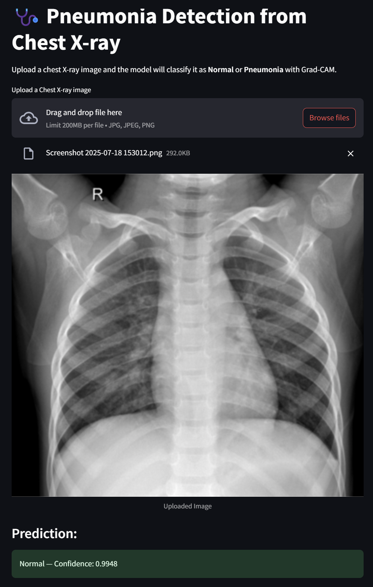
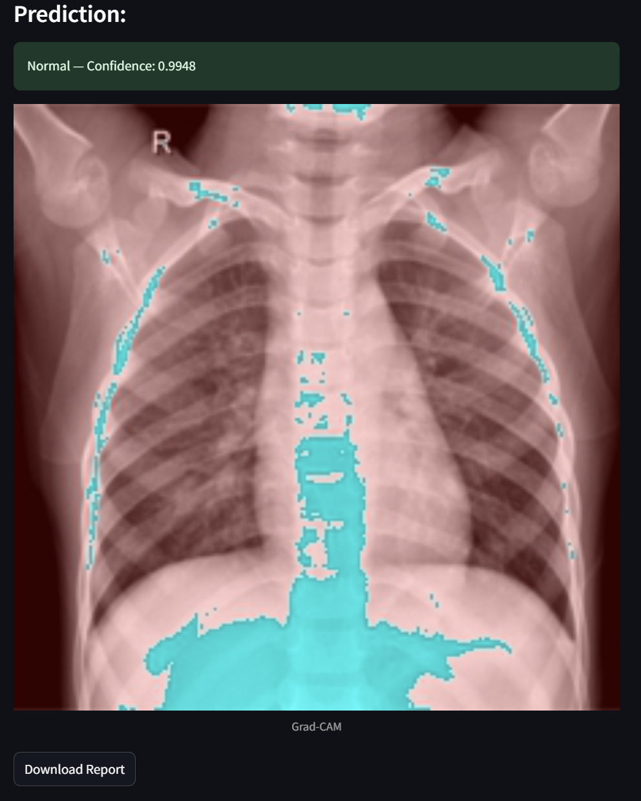
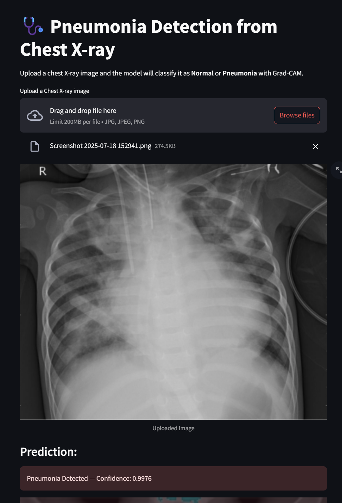
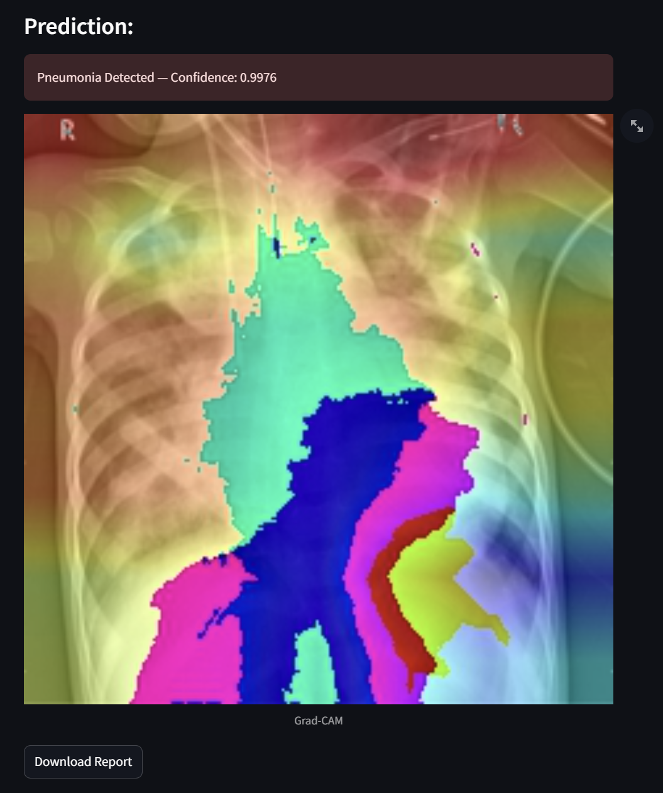

# 🩺 Medical Image Classifier

A deep learning-based web application for the classification of chest X-rays to detect **Pneumonia**. The app supports **Grad-CAM visualizations** to interpret model predictions and allows users to **preview and download detailed prediction reports**.

## 🚀 Features

- ✅ Pneumonia Detection from Chest X-rays  
- ✅ Grad-CAM Heatmaps for Visual Explanation  
- ✅ PDF/HTML Report Generation and Download  
- ✅ Clean Streamlit-based UI  
- ✅ Support for Single Image Inference  

## 🧠 Model Architecture

- CNN-based custom architecture (can be swapped with ResNet, DenseNet, etc.)  
- Trained on labeled chest X-ray datasets (see below)  
- Binary classification: `Normal` vs `Pneumonia`  

<h2>🖼️ Sample Chest X-ray Image</h2>

<p float="left">
  
  
</p>
<p float='left'>
  
  
</p>

## 🛠️ Tech Stack

- **Frontend:** Streamlit  
- **Backend:** Python (TensorFlow / Keras / PyTorch)  
- **Visualization:** Matplotlib, OpenCV  
- **Deployment:** Streamlit Cloud / Localhost  (soon)
- **Data:** Public medical datasets (Kaggle, NIH, etc.)

## 📁 Project Structure
```
├── .streamlit/
│ └── config.toml # Streamlit app configuration
├── app/
│ └── streamlit_app.py # Streamlit frontend application
├── data/
│ └── chest_xray/ # Dataset folders
│ ├── train/ # Training images
│ ├── test/ # Testing images
│ └── val/ # Validation images
├── docs/
│ └── project_architecture.doc # Architecture documentation
├── models/
│ └── penumonia_model.h5 # Trained model file
├── notebooks/
│ ├── 01_eda_and_preprocessing.ipynb # Data exploration & preprocessing
│ └── 02_model_training.ipynb # Model training
├── src/
│ ├── model.py # Model loading and prediction functions
│ └── init.py
├── .gitignore
├── README.md # Project overview (this file)
├── requirements.txt # Python dependencies
└── runtime.txt # Runtime version (for platforms like Heroku)
```


---

## 🚀 Features

- Upload chest X-ray images and detect **Pneumonia** in real-time
- Built with a pre-trained CNN model saved as `.h5`
- Interactive Streamlit frontend
- Exploratory Data Analysis and training available in Jupyter notebooks
- Modular Python codebase (`src/`)

---

## 🛠️ Installation

1. **Clone the repository**
```bash
git clone https://github.com/your-username/pneumonia-detection.git
cd pneumonia-detection
```

2. **Create a virtual environment and activate it**
```bash
python -m venv venv
source venv/bin/activate  # On Windows: venv\Scripts\activate
```
2. **Install dependencies**
```bash
pip install -r requirements.txt
```

## Running the app
```bash
streamlit run app/streamlit_app.py
```
   


